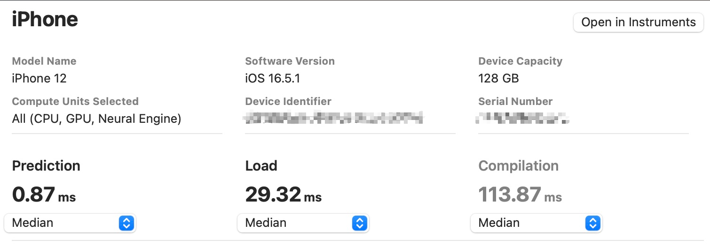

# [RepViT: Revisiting  Mobile CNN From ViT Perspective](https://arxiv.org/abs/2307.09283)

Official PyTorch implementation of **RepViT**, from the following paper:

[RepViT: Revisiting  Mobile CNN From ViT Perspective](https://arxiv.org/abs/2307.09283).\
Ao Wang, Hui Chen, Zijia Lin, Hengjun Pu, and Guiguang Ding\
[[`arXiv`](https://arxiv.org/abs/2307.09283)]

<p align="center">
   <br>
  Models are trained on ImageNet-1K and deployed on iPhone 12 with Core ML Tools to get latency.
</p>

<details>
  <summary>
  <font size="+1">Abstract</font>
  </summary>
Recently, lightweight Vision Transformers (ViTs) demonstrate superior performance and lower latency compared with lightweight Convolutional Neural Networks (CNNs) on resource-constrained mobile devices. This improvement is usually attributed to the multi-head self-attention module, which enables the model to learn global representations. However, the architectural disparities between lightweight ViTs and lightweight CNNs have not been adequately examined. In this study, we revisit the efficient design of lightweight CNNs and emphasize their potential for mobile devices. We incrementally enhance the mobile-friendliness of a standard lightweight CNN, specifically MobileNetV3, by integrating the efficient architectural choices of lightweight ViTs. This ends up with a new family of pure lightweight CNNs, namely RepViT. Extensive experiments show that RepViT outperforms existing state-of-the-art lightweight ViTs and exhibits favorable latency in various vision tasks. On ImageNet, RepViT achieves over 80\% top-1 accuracy with 1ms latency on an iPhone 12, which is the first time for a lightweight model, to the best of our knowledge. Our largest model, RepViT-M2.3, obtains 83.7\% accuracy with only 2.3ms latency.
</details>

<br/>

**UPDATES** 🔥
- 2023/09/28: RepViT-M0.9/1.0/1.1/1.5/2.3 models have been released.
- 2023/07/27: RepViT models have been integrated into timm. See https://github.com/huggingface/pytorch-image-models/pull/1876.

<br/>

## Classification on ImageNet-1K

### Models

| Model | Top-1 (300 / 450)| #params | MACs | Latency | Ckpt | Core ML | Log |
|:---------------|:----:|:---:|:--:|:--:|:--:|:--:|:--:|
| M0.9 |   78.7 / 79.1  |     5.1M    |   0.8G   |      0.9ms     |  [300e](https://github.com/THU-MIG/RepViT/releases/download/v1.0/repvit_m0_9_distill_300e.pth) / [450e](https://github.com/THU-MIG/RepViT/releases/download/v1.0/repvit_m0_9_distill_450e.pth)    |   [300e](https://github.com/THU-MIG/RepViT/releases/download/v1.0/repvit_m0_9_distiall_300e_224.mlmodel) / [450e](https://github.com/THU-MIG/RepViT/releases/download/v1.0/repvit_m0_9_distiall_450e_224.mlmodel)  | [300e](./logs/repvit_m0_9_distill_300e.txt) / [450e](./logs/repvit_m0_9_distill_450e.txt) |
| M1.0 |   80.0 / 80.3   |     6.8M    |   1.1G   |      1.0ms     | [300e](https://github.com/THU-MIG/RepViT/releases/download/v1.0/repvit_m1_0_distill_300e.pth) / [450e](https://github.com/THU-MIG/RepViT/releases/download/v1.0/repvit_m1_0_distill_450e.pth)    |   [300e](https://github.com/THU-MIG/RepViT/releases/download/v1.0/repvit_m1_0_distiall_300e_224.mlmodel) / [450e](https://github.com/THU-MIG/RepViT/releases/download/v1.0/repvit_m1_0_distiall_450e_224.mlmodel)  | [300e](./logs/repvit_m1_0_distill_300e.txt) / [450e](./logs/repvit_m1_0_distill_450e.txt) |
| M1.1 |   80.7 / 81.2   |     8.2M    |   1.3G   |      1.1ms     | [300e](https://github.com/THU-MIG/RepViT/releases/download/v1.0/repvit_m1_1_distill_300e.pth) / [450e](https://github.com/THU-MIG/RepViT/releases/download/v1.0/repvit_m1_1_distill_450e.pth)    |   [300e](https://github.com/THU-MIG/RepViT/releases/download/v1.0/repvit_m1_1_distiall_300e_224.mlmodel) / [450e](https://github.com/THU-MIG/RepViT/releases/download/v1.0/repvit_m1_1_distiall_450e_224.mlmodel)  | [300e](./logs/repvit_m1_1_distill_300e.txt) / [450e](./logs/repvit_m1_1_distill_450e.txt) |
| M1.5 |   82.3 / 82.5   |     14.0M    |   2.3G   |      1.5ms     | [300e](https://github.com/THU-MIG/RepViT/releases/download/v1.0/repvit_m1_5_distill_300e.pth) / [450e](https://github.com/THU-MIG/RepViT/releases/download/v1.0/repvit_m1_5_distill_450e.pth)    |   [300e](https://github.com/THU-MIG/RepViT/releases/download/v1.0/repvit_m1_5_distiall_300e_224.mlmodel) / [450e](https://github.com/THU-MIG/RepViT/releases/download/v1.0/repvit_m1_5_distiall_450e_224.mlmodel)  | [300e](./logs/repvit_m1_5_distill_300e.txt) / [450e](./logs/repvit_m1_5_distill_450e.txt) |
| M2.3 |   83.3 / 83.7   |     22.9M    |   4.5G   |      2.3ms     | [300e](https://github.com/THU-MIG/RepViT/releases/download/v1.0/repvit_m2_3_distill_300e.pth) / [450e](https://github.com/THU-MIG/RepViT/releases/download/v1.0/repvit_m2_3_distill_450e.pth)    |   [300e](https://github.com/THU-MIG/RepViT/releases/download/v1.0/repvit_m2_3_distiall_300e_224.mlmodel) / [450e](https://github.com/THU-MIG/RepViT/releases/download/v1.0/repvit_m2_3_distiall_450e_224.mlmodel)  | [300e](./logs/repvit_m2_3_distill_300e.txt) / [450e](./logs/repvit_m2_3_distill_450e.txt) |


Tips: Convert a training-time RepViT into the inference-time structure
```
from timm.models import create_model
import utils

model = create_model('repvit_m0_9')
utils.replace_batchnorm(model)
```

## Latency Measurement 

The latency reported in RepViT for iPhone 12 (iOS 16) uses the benchmark tool from [XCode 14](https://developer.apple.com/videos/play/wwdc2022/10027/).
For example, here is a latency measurement of RepViT-M1:



Tips: export the model to Core ML model
```
python export_coreml.py --model repvit_m0_9 --ckpt pretrain/repvit_m0_9_distill_300e.pth
```
Tips: measure the throughput on GPU
```
python speed_gpu.py --model repvit_m0_9
```


## ImageNet  

### Prerequisites
`conda` virtual environment is recommended. 
```
conda create -n repvit python=3.8
pip install -r requirements.txt
```

### Data preparation

Download and extract ImageNet train and val images from http://image-net.org/. The training and validation data are expected to be in the `train` folder and `val` folder respectively:
```
|-- /path/to/imagenet/
    |-- train
    |-- val
```

### Training
To train RepViT-M1 on an 8-GPU machine:

```
python -m torch.distributed.launch --nproc_per_node=8 --master_port 12346 --use_env main.py --model repvit_m0_9 --data-path ~/imagenet --dist-eval
```
Tips: specify your data path and model name! 

### Testing 
For example, to test RepViT-M1:
```
python main.py --eval --model repvit_m0_9 --resume pretrain/repvit_m0_9_distill_300e.pth --data-path ~/imagenet
```

## Downstream Tasks
[Object Detection and Instance Segmentation](detection/README.md)<br>
[Semantic Segmentation](segmentation/README.md)

## Acknowledgement

Classification (ImageNet) code base is partly built with [LeViT](https://github.com/facebookresearch/LeViT), [PoolFormer](https://github.com/sail-sg/poolformer) and [EfficientFormer](https://github.com/snap-research/EfficientFormer). 

The detection and segmentation pipeline is from [MMCV](https://github.com/open-mmlab/mmcv) ([MMDetection](https://github.com/open-mmlab/mmdetection) and [MMSegmentation](https://github.com/open-mmlab/mmsegmentation)). 

Thanks for the great implementations! 

## Citation

If our code or models help your work, please cite our paper:
```BibTeX
@misc{wang2023repvit,
      title={RepViT: Revisiting Mobile CNN From ViT Perspective}, 
      author={Ao Wang and Hui Chen and Zijia Lin and Hengjun Pu and Guiguang Ding},
      year={2023},
      eprint={2307.09283},
      archivePrefix={arXiv},
      primaryClass={cs.CV}
}
```
